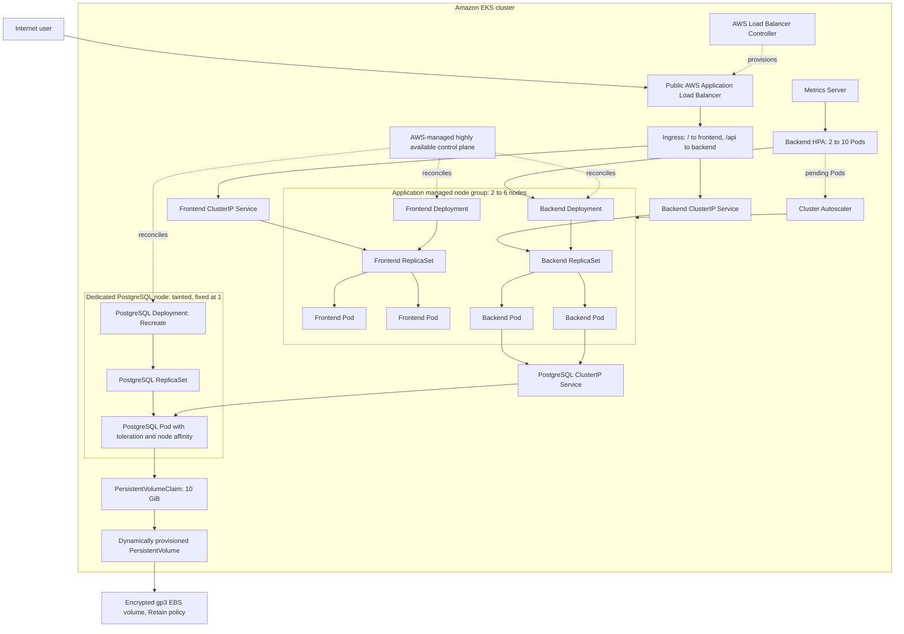

# Kubernetes architecture

## Design notes

- EKS operates the control plane across multiple Availability Zones; it is not a fourth EC2 instance managed by this project.
- The initial data plane is three EC2 workers: two application nodes and one fixed, dedicated PostgreSQL node.
- `Deployment -> ReplicaSet -> Pod` ownership is shown explicitly. Services select Pods by labels; they do not route to Deployments.
- The ALB is the only public entry point. Every Kubernetes Service is `ClusterIP`; PostgreSQL has no public route.
- The HPA creates/removes backend Pods. Cluster Autoscaler reacts only when Pods cannot be scheduled and changes the application node group's desired capacity.
- The PVC dynamically creates the PV through the EBS CSI driver. `WaitForFirstConsumer` aligns the EBS volume Availability Zone with the PostgreSQL node.

