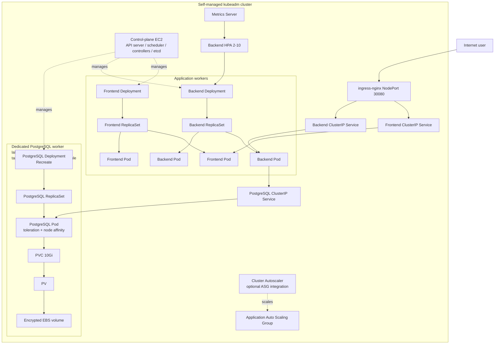

# Self-managed Kubernetes architecture

The Ingress NodePort is the only public entry point. Backend and PostgreSQL
Services are ClusterIP-only. Deployments own ReplicaSets, ReplicaSets own
Pods, the HPA changes backend replica count, and the node autoscaler changes
only an application ASG when configured. PostgreSQL uses a single-writer
Recreate strategy and retained persistent storage; a production database needs
replication, backups, and restore testing.
